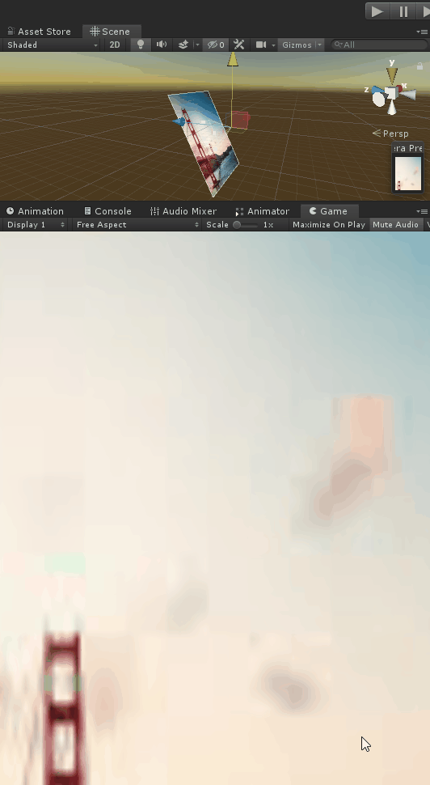

# UnitySnapCameraToCanvas
Script that aligns a Camera to a World Canvas

###### How To Use:
Add SnapCameraToCanvas.cs to a component in your scene.
Apply World Canvas to Canvas variabl.
Run game
See the align has snapped to the canvas.